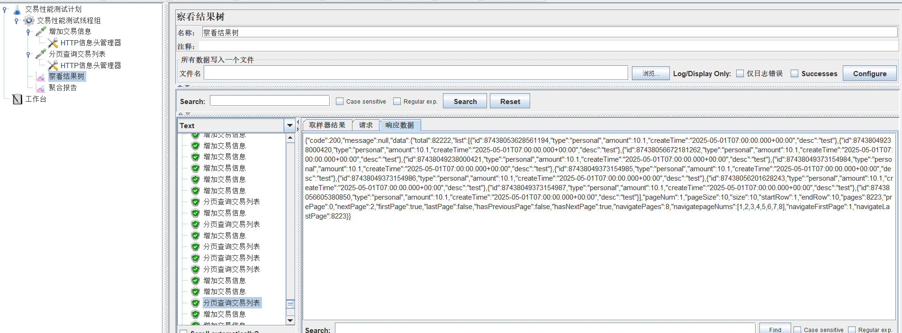

# bank-transaction-service

银行交易服务：

1、目录说明
config 缓存配置。
controller controller层。
entity 实体类定义。
exception 异常、全局处理类 。
service 业务逻辑层。
util 工具类（id生成工具、分页工具）。

2、第三方jar包和插件
1）pagehelper-spring-boot-starter 分页工具包。 
2)lombok 通过注解自动生成常见的样板代码（如getter/setter、构造函数等），显著提升开发效率和代码简洁性。
3) junit 单元测试工具。
4) caffeine 高性能本地缓存库。
5) spring-boot-maven-plugin打包插件。
6）dockerfile-maven-plugin 快速构建docker镜像插件。
7)maven-surefire-plugin 测试运行器(Test Runner)，它能兼容JUnit3、JUnit4。

3、实现接口 1）交易信息新增、修改、删除、分页查询列表等接口。
2）本地缓存caffeine最大存储条目数配置项service.cache.caffeine.maximumSize，存储时间单位分钟配置项service.cache.caffeine.expireAfterWrite。

4、打包说明 1)mvn clean package 自动打包生成 bank-transaction-service-0.0.1.jar，程序编译和运行jdk版本为jdk21。 2)mvn dockerfile:
build，生成镜像文件,注:需要改pom.xml,把dockerfile-maven-plugin前后注释去掉。

5、测试 1）单元测试 mvn test 自动运行单元测试。 运行结果： Results :
Tests run: 12, Failures: 0, Errors: 0, Skipped: 0

2)JMeter性能测试

压测结果：
1)新增交易接口：95%响应时间21ms，吞吐量:538.8/sec，错误率（停止测试影响)。
2)分页查询交易列表接口：95%响应时间69ms，吞吐量:539.4/sec，错误率（停止测试影响)。
